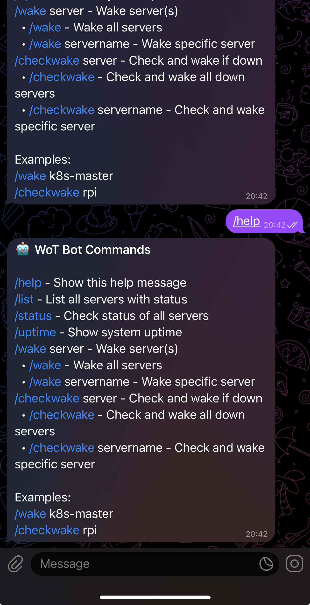
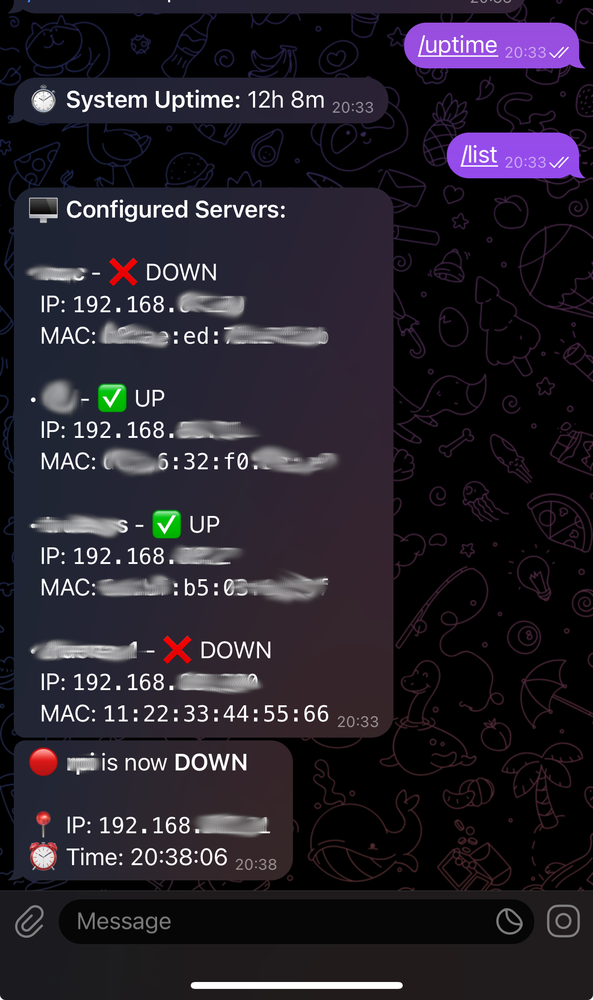

# Wake-on-LAN Telegram Bot (WoT)

A Telegram bot for managing Wake-on-LAN magic packets and server monitoring. Control your servers remotely through Telegram with automatic status monitoring and notifications.

## Features

- **Telegram Bot Interface**: Control servers through simple chat commands
- **Wake-on-LAN**: Send magic packets to individual servers or all configured servers
- **Server Monitoring**: Automatic status checking with notifications on status changes
- **Smart Wake**: Check status and only wake servers that are down
- **JSON Configuration**: Easy server configuration with Telegram bot settings
- **Cross-platform**: Runs on Linux, including Raspberry Pi (ARM/ARM64)
- **SystemD Integration**: Run as a system service with automatic restart

## Real-World Use Case: Power Outage Recovery

**Problem**: During power outages, servers shut down and don't automatically restart when power returns. If you're away from home, you're stuck without access to your infrastructure until you can physically restart everything.

**Solution**: A Raspberry Pi Zero W running the WoT bot provides an elegant, low-cost solution:

### The Setup
- **Always-On Monitor**: Raspberry Pi Zero W automatically boots when power returns
- **Minimal Power Draw**: ~1W power consumption, can run on UPS for hours
- **Remote Control**: Get notified via Telegram when power returns
- **Smart Recovery**: Automatically detect which servers are down and wake them remotely
- **Manual Override**: Wake specific servers on-demand through Telegram chat


### How It Works
1. **Power Returns**: Pi Zero W boots automatically (no intervention needed)
2. **Status Check**: Bot immediately checks all configured servers
3. **Telegram Notification**: You receive a message showing which servers are down
4. **Remote Wake**: Use `/checkwake` to wake all down servers, or wake specific ones with `/wake servername`
5. **Monitoring**: Continuous monitoring ensures you're notified if servers go down again

### Why Raspberry Pi Zero W?
- **Ultra Low Power**: Survives longer on UPS backup power
- **Automatic Boot**: No manual intervention required when power returns  
- **Always Connected**: Built-in WiFi ensures immediate connectivity
- **Cost Effective**: ~$15 hardware investment for enterprise-grade recovery capability
- **Reliable**: Solid-state storage means no moving parts to fail

> **Perfect for**: Home labs, small offices, remote locations, or anywhere you need reliable server recovery without physical access.

## Screenshots

See the WoT bot in action:

| Feature | Screenshot |
|---------|------------|
| Available Commands |  |
| Server Status List |  |

## ⚠️ Disclaimer

**This software is provided "as is" without warranty of any kind, express or implied. Use at your own risk.**

- **No Guarantees**: The authors make no guarantees about the reliability, availability, or functionality of this software
- **Network Security**: This tool sends network packets and runs as a system service - ensure you understand the security implications
- **Power Management**: Wake-on-LAN functionality depends on proper hardware configuration and network setup
- **Data Loss**: Monitor your systems independently - do not rely solely on this tool for critical infrastructure monitoring
- **Testing Required**: Always test thoroughly in your environment before deploying in production
- **Your Responsibility**: You are responsible for securing your bot tokens, configuring your network properly, and maintaining your systems

**By using this software, you acknowledge that you understand these risks and agree to use it at your own discretion.**

## Installation

### Option 1: Pre-built Packages (Recommended)

Download the pre-built package for your platform from the [releases page](https://github.com/tsolodov/wot/releases):

#### Raspberry Pi Zero/W (ARMv6) - Ideal for Power Outage Recovery
Perfect for the use case described above - ultra-low power consumption and automatic boot.

```bash
# Download and verify
curl -L -O https://github.com/tsolodov/wot/releases/latest/download/wot-raspberrypi-zero-w.tar.gz
curl -L -O https://github.com/tsolodov/wot/releases/latest/download/wot-raspberrypi-zero-w.tar.gz.sha256
sha256sum -c wot-raspberrypi-zero-w.tar.gz.sha256

# Extract and install
tar -xzf wot-raspberrypi-zero-w.tar.gz
cd package
sudo ./install.sh
```

**Pi Zero W Setup Tips:**
- Enable SSH during Pi OS installation for headless setup
- Configure WiFi credentials in `/boot/wpa_supplicant.conf` before first boot
- The service starts automatically after installation - perfect for unattended operation

#### Raspberry Pi 2/3/4 (ARMv7)
```bash
# Download and verify
curl -L -O https://github.com/tsolodov/wot/releases/latest/download/wot-raspberrypi-2-3-4.tar.gz
curl -L -O https://github.com/tsolodov/wot/releases/latest/download/wot-raspberrypi-2-3-4.tar.gz.sha256
sha256sum -c wot-raspberrypi-2-3-4.tar.gz.sha256

# Extract and install
tar -xzf wot-raspberrypi-2-3-4.tar.gz
cd package
sudo ./install.sh
```

#### Raspberry Pi 4 64-bit (ARM64)
```bash
# Download and verify
curl -L -O https://github.com/tsolodov/wot/releases/latest/download/wot-raspberrypi-4-64bit.tar.gz
curl -L -O https://github.com/tsolodov/wot/releases/latest/download/wot-raspberrypi-4-64bit.tar.gz.sha256
sha256sum -c wot-raspberrypi-4-64bit.tar.gz.sha256

# Extract and install
tar -xzf wot-raspberrypi-4-64bit.tar.gz
cd package
sudo ./install.sh
```

#### Linux x86_64
```bash
# Download and verify
curl -L -O https://github.com/tsolodov/wot/releases/latest/download/wot-linux-x86_64.tar.gz
curl -L -O https://github.com/tsolodov/wot/releases/latest/download/wot-linux-x86_64.tar.gz.sha256
sha256sum -c wot-linux-x86_64.tar.gz.sha256

# Extract and install
tar -xzf wot-linux-x86_64.tar.gz
cd package
sudo ./install.sh
```

### Option 2: Build from Source

```bash
git clone https://github.com/tsolodov/wot
cd wot
go build -o wot
```

## Configuration

Create a `config.json` file with your server configurations:

```json
{
  "servers": [
    {
      "name": "server1",
      "mac_address": "00:11:22:33:44:55",
      "ip_address": "192.168.1.100"
    },
    {
      "name": "server2", 
      "mac_address": "aa-bb-cc-dd-ee-ff",
      "ip_address": "192.168.1.101"
    }
  ],
  "broadcast_ip": "255.255.255.255",
  "monitoring_interval": 5,
  "telegram": {
    "bot_token": "YOUR_BOT_TOKEN_HERE",
    "admin_chat_id": 123456789
  }
}
```

### Configuration Fields

**Server Configuration:**
- `name`: Friendly name for the server
- `mac_address`: MAC address (supports `:` or `-` separators)
- `ip_address`: (Optional) IP address for status checking via ICMP ping

**Global Configuration:**
- `broadcast_ip`: (Optional) Broadcast IP address for Wake-on-LAN packets (defaults to 255.255.255.255)
- `monitoring_interval`: (Optional) Server monitoring interval in minutes (defaults to 5, only applies in bot mode)

**Telegram Configuration (Required):**
- `bot_token`: Bot token from @BotFather
- `admin_chat_id`: Chat ID of authorized user (get from @userinfobot)

> **Note**: Telegram configuration is required as the application only runs as a Telegram bot.

### Environment Variable Override

For security and deployment flexibility, you can override Telegram credentials using environment variables:

- `WOT_BOT_TOKEN` - Overrides `telegram.bot_token` from config file
- `WOT_ADMIN_CHAT_ID` - Overrides `telegram.admin_chat_id` from config file

**Example:**
```bash
export WOT_BOT_TOKEN="1234567890:ABCdefGHIjklMNOpqrsTUVwxyz"
export WOT_ADMIN_CHAT_ID="123456789"
./wot  # Uses environment variables instead of config.json values
```

Environment variables take precedence over config file values, making them ideal for Docker containers, systemd services, and CI/CD deployments.

## Usage

The WoT bot runs as a Telegram bot service. Start it with:

```bash
# Run with default config file (config.json)
./wot

# Run with custom config file
./wot -config /path/to/config.json
```

## Command Line Options

- `-config`: Path to configuration file (default: `config.json`)

All server management is done through Telegram bot commands once the service is running.

## Telegram Bot Commands

The following commands are available in your Telegram chat with the bot:

### Help Command
Use `/help` to see all available commands (see screenshot in [Screenshots](#screenshots) section above).

### Available Commands
- `/help` - Show bot commands
- `/list` - List all servers with status
- `/status` - Check status of all servers
- `/uptime` - Show system uptime
- `/wake [server]` - Wake server(s)
  - `/wake` - Wake all servers
  - `/wake servername` - Wake specific server
- `/checkwake [server]` - Check and wake if down
  - `/checkwake` - Check and wake all down servers
  - `/checkwake servername` - Check and wake specific server

### Server List Example
The `/list` command shows all configured servers with their current status (see screenshot in [Screenshots](#screenshots) section above).

## Setting up Telegram Bot

### Step 1: Create a Telegram Bot

1. **Open Telegram** and search for `@BotFather`
2. **Start a chat** with BotFather by clicking "Start" or typing `/start`
3. **Create a new bot** by sending the command:
   ```
   /newbot
   ```
4. **Choose a name** for your bot (e.g., "My WoT Bot")
5. **Choose a username** for your bot (must end with 'bot', e.g., "mywot_bot")
6. **Save the bot token** - BotFather will provide a token like:
   ```
   1234567890:ABCdefGHIjklMNOpqrsTUVwxyz
   ```
   > ⚠️ **Important**: Keep this token secure! Anyone with this token can control your bot.

### Step 2: Get Your Chat ID

You need your Telegram chat ID so the bot knows where to send messages.

#### Method 1: Using @userinfobot (Recommended)
1. **Search for** `@userinfobot` in Telegram
2. **Start the bot** and it will immediately send you your user information
3. **Copy your Chat ID** (it will be a number like `123456789`)

#### Method 2: Using @getidsbot
1. **Search for** `@getidsbot` in Telegram  
2. **Send any message** to the bot
3. **Copy the "Your user ID"** from the response

#### Method 3: Manual method
1. **Replace `YOUR_BOT_TOKEN`** in this URL with your actual bot token:
   ```
   https://api.telegram.org/botYOUR_BOT_TOKEN/getUpdates
   ```
2. **Send a message** to your bot first
3. **Visit the URL** in your browser
4. **Look for** `"chat":{"id":123456789` in the response
5. **Copy the number** after `"id":`

### Step 3: Configure the Bot

1. **Edit your config file**:
   ```bash
   nano config.json
   ```

2. **Update the telegram section**:
   ```json
   {
     "servers": [
       // ... your servers here
     ],
     "telegram": {
       "bot_token": "1234567890:ABCdefGHIjklMNOpqrsTUVwxyz",
       "admin_chat_id": 123456789
     }
   }
   ```

3. **Save and exit** the editor (Ctrl+X, then Y, then Enter in nano)

### Step 4: Test Your Bot

1. **Start the WoT bot**:
   ```bash
   ./wot
   ```

2. **Open Telegram** and find your bot (search for the username you created)

3. **Send a test command**:
   ```
   /help
   ```

4. **Verify** you receive a response with the available commands

If successful, you should see the help response with available commands (refer to the screenshot in the [Screenshots](#screenshots) section).

### Security Best Practices

- **Never share your bot token** in public repositories or chat
- **Use environment variables** for production deployments:
  ```bash
  export WOT_BOT_TOKEN="your_token_here"
  export WOT_ADMIN_CHAT_ID="your_chat_id_here"
  ./wot  # Environment variables override config.json values
  ```
- **Regenerate the token** if it's ever compromised (use `/token` with @BotFather)
- **Only give the bot token** to trusted systems

### Troubleshooting

**Bot doesn't respond:**
- Verify the bot token is correct and hasn't been regenerated
- Check that you've started a chat with the bot first
- Ensure the WoT application is running without errors

**"Unauthorized" errors:**
- Double-check your bot token in `config.json`
- Make sure there are no extra spaces or characters in the token

**Messages not received:**
- Verify your chat ID is correct and matches your Telegram account
- Check that the admin_chat_id field contains a number, not a string
- Ensure you've sent at least one message to the bot first

### Quick Reference

**Essential Telegram Bots for Setup:**
- `@BotFather` - Create and manage your bot
- `@userinfobot` - Get your chat ID (recommended)
- `@getidsbot` - Alternative way to get your chat ID

**Required Information:**
- Bot Token: Get from @BotFather when creating your bot
- Chat ID: Get from @userinfobot or @getidsbot
- Both go in the `telegram` section of your `config.json`

## Server Monitoring

The bot automatically monitors server status and sends notifications. The server list shows status indicators: ✅ UP, ❌ DOWN, ❓ NO IP (see server status screenshot in the [Screenshots](#screenshots) section).

### Features
- **Automatic monitoring**: Checks server status at regular intervals (configurable via `monitoring_interval`)
- **Status change notifications**: Receives Telegram messages when servers go up or down
- **Smart monitoring**: Only monitors servers with IP addresses configured
- **Startup notification**: Get notified when the bot starts with system uptime

### Monitoring Details
- Default interval: 5 minutes (configurable via `monitoring_interval` in `config.json`)
- Uses ICMP ping for status checking with TCP fallback for unprivileged operation
- Notifications include server name, status change, IP address, and timestamp
- Only sends notifications when server status actually changes (not on every check)

**For Power Outage Recovery**: Consider setting `monitoring_interval` to 1-2 minutes for faster detection when power returns, allowing quicker server recovery.

## SystemD Service Installation

To run the bot as a system service with automatic restart on failure:

### 1. Build for target architecture
```bash
# For ARMv6 (Raspberry Pi Zero/1)
GOOS=linux GOARCH=arm GOARM=6 go build -o wot-armv6l

# For ARMv7 (Raspberry Pi 2/3/4)  
GOOS=linux GOARCH=arm GOARM=7 go build -o wot-armv7l

# For x86_64
go build -o wot
```

### 2. Install files
```bash
# Copy binary to system location
sudo cp wot-armv6l /usr/bin/wot
sudo chmod +x /usr/bin/wot

# Copy config to system config directory
sudo mkdir -p /etc/wot
sudo cp config.json /etc/wot/
sudo chmod 644 /etc/wot/config.json
```

### 3. Install systemd service
```bash
# Copy service file
sudo cp wot-bot.service /etc/systemd/system/

# Reload systemd and enable service
sudo systemctl daemon-reload
sudo systemctl enable wot-bot.service
sudo systemctl start wot-bot.service
```

### 4. Service Management
```bash
# Check status
sudo systemctl status wot-bot

# View logs
sudo journalctl -u wot-bot -f

# Restart service
sudo systemctl restart wot-bot

# Stop service
sudo systemctl stop wot-bot
```

## Post-Installation Setup

After installing via the pre-built packages:

### 1. Configure Your Servers
Edit the configuration file with your server details:
```bash
sudo nano /etc/wot/config.json
```

### 2. Enable and Start the Service
```bash
sudo systemctl enable wot-bot
sudo systemctl start wot-bot
```

### 3. Verify Installation
```bash
# Check service status
sudo systemctl status wot-bot

# Test bot with custom config
wot -config /etc/wot/config.json

# View service logs
sudo journalctl -u wot-bot -f
```

### Service Features
- **Auto-restart**: Restarts on failure with 5-second delay
- **Restart limits**: Maximum 100 restarts per 5-minute window
- **Dynamic user**: Creates isolated user automatically
- **Enhanced security**: Comprehensive systemd hardening with network restrictions
- **Resource limits**: Memory (128MB) and CPU (50%) limits
- **Network security**: Restricted to required IP ranges and Telegram API access
- **Standard paths**: Uses systemd standard directories
- **Environment support**: Built-in support for environment variables
- **Logging**: All output goes to systemd journal

### Using Environment Variables with SystemD

For secure credential management, you can override the systemd service to use environment variables:

```bash
# Create environment file
sudo tee /etc/wot/environment << EOF
WOT_BOT_TOKEN=your_real_bot_token_here
WOT_ADMIN_CHAT_ID=your_real_chat_id_here
EOF

# Secure the environment file
sudo chmod 600 /etc/wot/environment
sudo chown root:root /etc/wot/environment

# Create systemd override
sudo mkdir -p /etc/systemd/system/wot-bot.service.d
sudo tee /etc/systemd/system/wot-bot.service.d/environment.conf << EOF
[Service]
EnvironmentFile=/etc/wot/environment
EOF

# Reload and restart
sudo systemctl daemon-reload
sudo systemctl restart wot-bot
```

### Troubleshooting
- Config location: `/etc/wot/config.json`
- State directory: `/var/lib/wot/` (created automatically)
- Service runs as dynamic user (no need to create user account)

## Status Checking

The program checks server status using a hybrid approach:
- **Primary method**: ICMP ping packets for privileged operation
- **Fallback method**: TCP connection attempts to common ports (22, 80, 443, 53) for unprivileged operation
- Cross-platform compatible (Linux, macOS, Windows)
- Servers without IP addresses cannot be status checked and will show as "NO IP"

## Magic Packet Format

The program sends a standard Wake-on-LAN magic packet:
- 6 bytes of 0xFF
- 16 repetitions of the target MAC address
- Total packet size: 102 bytes
- Sent via UDP to port 9 (or custom port)